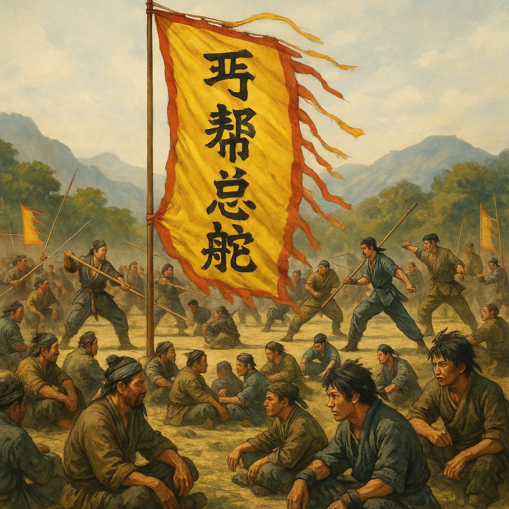
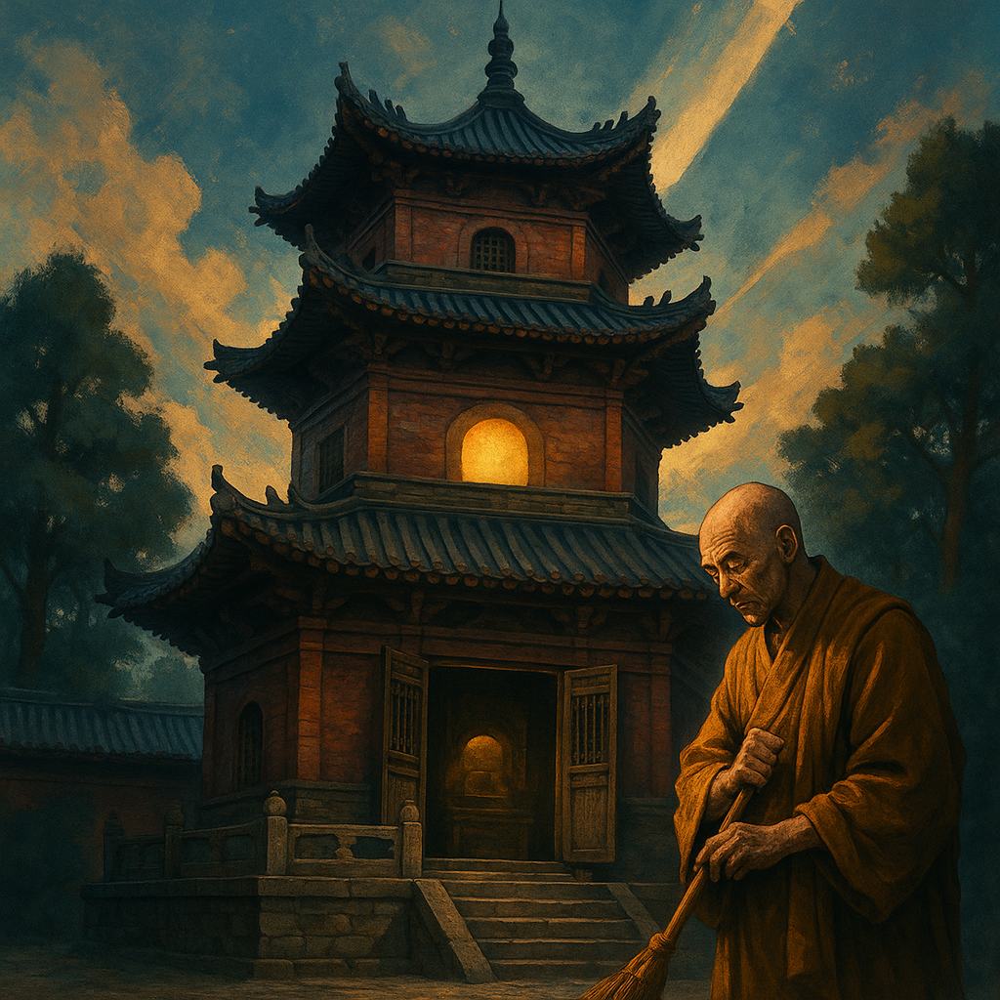
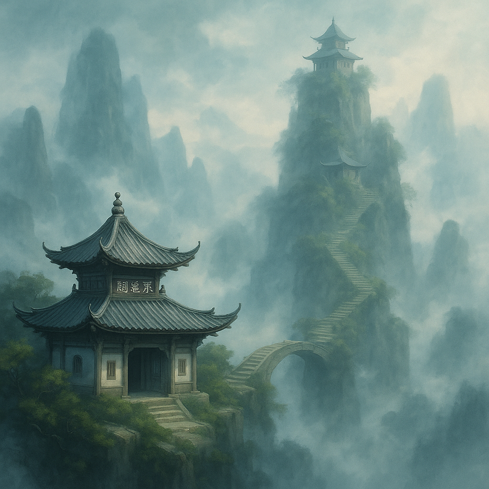
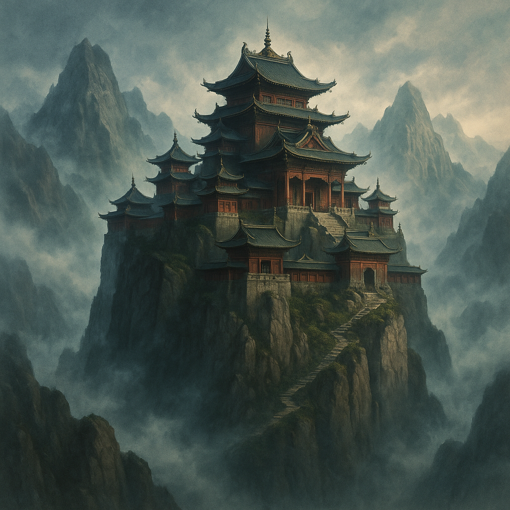
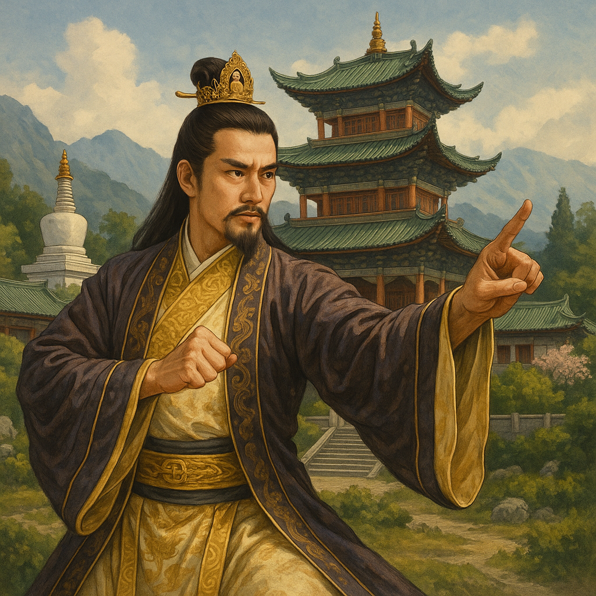
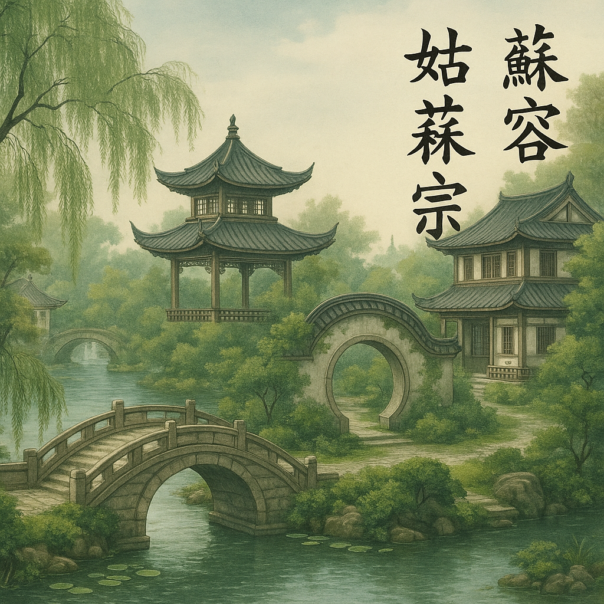

# 《天龙八部》中的江湖门派与势力

同学们好！在《天龙八部》的世界里，除了精彩的人物故事，还有一个错综复杂的江湖势力网络。这些门派和势力各有特色，相互之间既有合作也有竞争，构成了一个多姿多彩的武林世界。今天，我们就来一起了解这些门派和势力！

## 丐帮：天下第一大帮

**帮主**：乔峰（前任）
**总部**：遍布天下，无固定总舵
**创始人**：历史上有多位杰出帮主

丐帮是《天龙八部》中最具代表性的势力之一，是天下第一大帮，也是武林中最为特殊的一个门派。

**特点**：
- 成员众多，分布广泛，遍布天下各地
- 组织严密，分为净衣派和污衣派，设有帮主和各袋弟子
- 以行侠仗义为宗旨，扶弱济贫
- 情报网络发达，消息灵通

**镇帮绝学**：
- **降龙十八掌**：丐帮最高武学，威力无穷
- **打狗棒法**：丐帮帮主专用武功，变化多端

**重要人物**：
- **乔峰**：丐帮前任帮主，武功盖世
- **宋奚陈吴**：丐帮四大长老（通常为宋、奚、陈、吴四姓长老）

> 丐帮虽然成员多为乞丐，但他们行事光明磊落，重视义气，在武林中享有崇高声誉。

## 少林寺：武林泰山北斗

**方丈**：玄慈
**位置**：嵩山
**创始人**：达摩祖师

少林寺是中原武林的泰山北斗，是佛教禅宗的祖庭，也是武学的发源地之一。

**特点**：
- 武僧众多，戒律森严
- 佛法和武功并重，以佛法为本，武功为用
- 历史悠久，威望极高
- 藏经阁收藏大量武学秘籍，是武学宝库

**代表武功**：
- **易筋经**：少林镇寺之宝，武林至高内功
- **罗汉拳**：少林基础拳法，变化多端
- **一指禅功**：精妙指法，点穴功夫
- **金刚不坏体**：高深硬功，刀枪不入（与金钟罩类似）

**重要人物**：
- **玄慈**：现任方丈，佛法精深
- **玄难、玄寂、玄苦**等：戒律院、达摩院等首座或高僧
- **扫地僧**：藏经阁隐世高人，武功深不可测
- **虚竹**：小沙弥，后成为逍遥派掌门

> 少林寺的精神是"禅武合一"，讲究以禅入武，以武证禅，这也是中国传统武学的重要思想。

## 逍遥派：隐世奇门

**掌门**：无崖子（后为虚竹）
**位置**：隐居大理无量山（琅嬛福地）、聋哑谷、天山等地
**创始人**：逍遥子

逍遥派是《天龙八部》中最神秘的门派之一，隐世不出，但武功却极为精妙。

**特点**：
- 门人极少，但个个武功高强，且多才多艺
- 讲究逍遥自在，不拘世俗
- 武功独特，融合道家、佛家思想，追求艺术境界
- 与世隔绝，很少参与江湖事务

**代表武功**：
- **北冥神功**：吸人内力为己用的神奇内功
- **小无相功**：变化无穷的高深内功
- **凌波微步**：轻功绝学，如履平地
- **天山六阳掌**：刚猛无比的掌法
- **天山折梅手**：精妙绝伦的手法

**重要人物**：
- **无崖子**：前任掌门，琴棋书画无所不精，武功盖世
- **天山童姥**：灵鹫宫主，无崖子师姐
- **李秋水**：西夏皇太妃，无崖子师妹
- **苏星河**：无崖子大弟子，"聪辩先生"
- **虚竹**：机缘巧合下继承掌门之位的少林小和尚

> 逍遥派的武功与其他门派截然不同，注重内外兼修，讲究随心所欲，不受拘束，正如其派名"逍遥"一样。

## 灵鹫宫：天山奇城

**宫主**：天山童姥（后为虚竹）
**位置**：天山缥缈峰
**创始人**：天山童姥

灵鹫宫是位于天山深处的神秘势力，由天山童姥一手创建，威震西域。

**特点**：
- 弟子多为女性，统领"三十六洞洞主、七十二岛岛主"
- 建在悬崖绝壁之上，易守难攻
- 行事隐秘，极少参与中原武林事务
- 与逍遥派关系密切

**代表武具/武功**：
- **生死符**：天山童姥的独门暗器，中者生不如死
- **八荒六合唯我独尊功**：天山童姥的成名绝技

**重要人物**：
- **天山童姥**：创建者，修炼奇功导致身体变化
- **梅兰竹菊四姐妹**：灵鹫宫四大侍女
- **虚竹**：意外继承灵鹫宫主之位的少林和尚

> 灵鹫宫的势力范围主要在西域一带，与中原武林较为隔绝，但也因生死符而控制了许多江湖人物。

## 大理段氏：皇室武学

**掌门人/代表**：段正明（保定帝）、段正淳（镇南王）
**位置**：大理国
**创始人**：段氏先祖

大理段氏は大理国の皇室家族，既掌握政权，也是一个武学世家。

**特点**：
- 结合佛法与武学，创造出独特的武功体系
- 与天龙寺关系密切，皇室成员多有出家为僧者
- 以仁政治国，深得民心
- 处于南方边陲，与中原武林既有联系又相对独立

**代表武功**：
- **一阳指**：大理段氏的精妙指法
- **六脉神剑**：段氏最高武学，无形剑气
- **枯荣禅功**：天龙寺高僧修炼的奇功

**重要人物**：
- **段誉**：大理国世子，后继承王位
- **段正淳**：镇南王，风流倜傥，段誉之父
- **枯荣大师、本因、本观**等：天龙寺高僧

> 大理段氏の武功融合了南方少数民族的特色和佛教思想，展现了中国古代多元文化的魅力。

## 姑苏慕容：江南豪族

**家主**：慕容博（後为慕容复）
**位置**：姑苏（今苏州）燕子坞、参合庄
**创始人**：慕容氏先祖（鲜卑燕国皇室）

姑苏慕容是江南地区的豪门望族，自称是鲜卑燕国皇室后裔，一直怀有复兴大燕国的梦想。

**特点**：
- 家族底蕴深厚，"还施水阁"收藏丰富的武学典籍
- 居住在豪华的燕子坞，环境优美
- 以复兴大燕为家族使命
- "南慕容"之名与"北乔峰"齐名

**代表武功**：
- **斗转星移**：借力打力，以彼之道还施彼身的绝学
- **参合指**：精妙的指法武功
- **慕容剑法**：家族流传的剑术

**重要人物**：
- **慕容复**：年轻家主，复国的主要推动者
- **慕容博**：慕容复之父，暗中策划复国大计
- **王语嫣**：慕容复表妹，武学知识渊博
- **邓百川、公冶乾、包不同、风波恶**：燕子坞四大家将

> 姑苏慕容家族的故事反映了历史变迁中家族命运的沉浮，以及执着追求理想可能带来的悲剧。

## 星宿派：邪派势力

**掌门**：丁春秋（星宿老怪）
**位置**：西域星宿海
**创始人**：丁春秋

星宿派是西域的一个新兴邪派，由丁春秋一手创建，以邪门毒功闻名。

**特点**：
- 门下弟子以阿谀奉承为主，"星宿老仙，法力无边，神通广大，法驾中原"
- 擅长使用毒功和邪门武技
- 丁春秋独断专行，弟子唯命是从
- 在西域地区有一定影响力，但在正派武林中声名狼藉

**代表武功**：
- **化功大法**：吸取他人内力的邪功
- **三笑逍遥散**：星宿派剧毒
- **各种毒功**

**重要人物**：
- **丁春秋**：星宿老怪，自称"星宿老仙"
- **阿紫**：丁春秋弟子，后追随乔峰
- **摘星子、狮吼子**等：星宿派弟子

> 星宿派代表了金庸笔下的"邪派"形象，丁春秋好大喜功，自私自利，与乔峰等人的侠义精神形成鲜明对比。

## 西夏一品堂：王朝势力

**代表**：西夏皇帝、赫连铁树将军
**位置**：西夏国
**性质**：西夏国の官方武力招揽机构

西夏一品堂是西夏国为招揽天下武林高手而设立的组织，旨在为西夏国效力。

**特点**：
- 背靠西夏国国力，资源丰富
- 成员多为被招揽的武林败类或高手
- 目的是为西夏国在武林和军事上扩张势力
- 曾多次与中原武林人士发生冲突

**代表人物**：
- **赫连铁树**：西夏征东大将军
- **四大恶人**（部分曾被招揽或合作）
- **李延宗**（慕容复化名）

**重要事件**：
- 策划进攻丐帮
- 意图夺取少林武功秘籍

> 西夏一品堂代表了政治势力对武林的影响，反映了古代中国周边少数民族政权的活动。

## 无量剑派：分裂门派

**掌门**：实际分为东西两宗宗主
**位置**：大理无量山
**关联**：与逍遥派的琅嬛福地有渊源

无量剑派是大理無量山の武林門派，分为东西两宗，因争夺剑湖宫而世代为仇。

**特点**：
- 派中分裂为东宗和西宗，相互敌对
- 剑法以快取胜，轻灵飘逸
- 地处大理，与中原武林联系较少
- 实力在书中开篇时已不算顶尖

**代表武功**：
- **无量剑法**：轻快灵活的剑术

**重要人物**：
- **左子穆**：无量剑东宗掌门
- **辛双清**：无量剑西宗掌门
- **段誉**：在此地初涉江湖，并发现琅嬛福地

> 無量剣派の分裂と争斗，是《天龙八部》开篇引入江湖纷争的一个引子，也间接引出了段誉的奇遇。

---

在《天龙八部》的世界中，这些门派和势力共同构成了一个充满变数的江湖。它们各有特色，又相互影响，反映了古代中国社会的复杂性和多样性。

金庸爷爷通过这些门派的描绘，向我们展示了不同的人生哲学和价值观：丐帮的侠义精神、少林的禅武合一、逍遥派的超然物外，以及姑苏慕容的执着复国。这些门派的兴衰成败，也让我们思考什么是真正的强大，什么是值得追求的人生目标。

在探索《天龙八部》的江湖势力时，我们不仅仅是在学习一个虚构世界的知识，更是在领略中国传统文化的丰富内涵和人生智慧！

