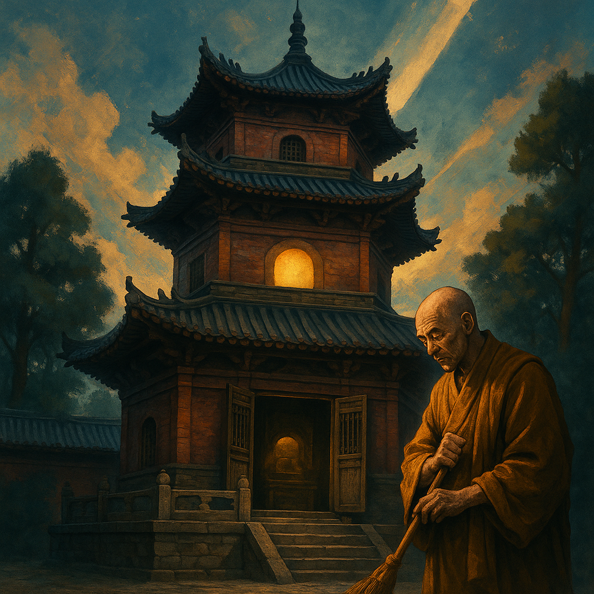

# 《天龙八部》中的重要地理位置

同学们，一部精彩的武侠小说，除了英雄人物和神功绝学，也离不开那些独具特色的地理环境。《天龙八部》的故事发生在广阔的中华大地上，甚至延伸到了周边的区域。让我们一起踏上这场地理探索之旅，看看主角们的足迹都遍布了哪些地方吧！

## 雁门关：英雄悲歌之地

**位置**：宋朝与辽国的边境（今山西省北部）
**重要事件**：乔峰身世之谜的开端，中原群雄伏击萧远山夫妇。

雁门关是古代中国北方重要的军事关隘，以险峻著称。在《天龙八部》中，这里是乔峰悲剧命运的起点。当年，乔峰的父母途经此地，遭到中原武林人士的误袭，酿成了无法挽回的悲剧。多年后，乔峰重返雁门关，在石壁上刻下遗言，试图以死化解宋辽两国的仇怨，展现了他为国为民的博大胸怀。

> 雁门关不仅是地理上的关口，更是民族冲突和英雄抉择的象征。

## 大理国：风花雪月之乡

**位置**：中国西南部（今云南省大理白族自治州）
**代表人物**：段誉、段正淳、段正明
**特色**：风景秀丽，气候宜人，佛教文化盛行，皇室段氏精通一阳指、六脉神剑等绝学。

大理国是段誉的故乡，一个充满诗情画意的地方。苍山洱海的秀美风光，独特的白族文化，以及神秘的天龙寺，都为这个地方增添了传奇色彩。段誉的冒险故事很多都与大理的宫廷和江湖势力相关。

> 大理国的存在，展现了《天龙八部》世界观的广阔，不仅仅局限于中原地区。

## 嵩山与少室山：禅宗武学圣地

**位置**：中原地区（今河南省登封市）
**关联门派**：少林寺
**重要事件**：少林寺武林大会，乔峰、段誉、虚竹三兄弟于少室山大战群雄。虚竹曾在此为僧。

嵩山是五岳中的中岳，少林寺便坐落于其腹地的少室山。少林寺是中原武林的泰山北斗，不仅佛法高深，武学也博大精深。书中的少室山大战，乔峰、段誉、虚竹三兄弟联手对抗天下英雄，是全书最高潮的场面之一。

> 少林寺代表了中原武林的正统和秩序，也是许多恩怨情仇的交汇点。

## 聚贤庄：英雄豪杰的试炼场

**位置**：中原某地
**重要事件**：游氏兄弟为对付乔峰广邀武林人士，乔峰为救阿朱在此大开杀戒，血战中原群雄。

聚贤庄一战是乔峰一生中极为惨烈的一战。为了救治受伤的阿朱，乔峰独闯龙潭虎穴，面对昔日好友和整个中原武林的敌意，他浴血奋战，展现了其盖世武功和虽千万人吾往矣的英雄气概。

> 聚贤庄见证了乔峰从受人敬仰的丐帮帮主到被整个武林追杀的契丹人的身份转变。

## 天山与缥缈峰：世外高人的隐居地

**位置**：西域（今新疆地区的天山山脉）
**关联门派/势力**：逍遥派、灵鹫宫
**重要人物**：天山童姥、虚竹
**特色**：地势险峻，气候寒冷，人迹罕至，是逍遥派、灵鹫宫等神秘门派的所在地。

天山缥缈峰上的灵鹫宫是天山童姥的地盘，也是虚竹后来成为宫主的地方。这里远离中原武林的喧嚣，充满了神秘色彩。逍遥派的武功也多与这片区域的清冷、飘逸气质相符。

> 天山象征着武林中那些超凡脱俗、不问世事的隐秘力量。

## 无量山：奇遇开始的地方

**位置**：大理国境内
**重要事件**：段誉误入无量玉璧（剑湖宫底），习得北冥神功和凌波微步。
**特色**：山势险峻，藏有琅嬛福地（神仙姐姐的洞府）。

无量山是段誉命运的转折点。他为了逃避学武，无意中闯入了隐藏的洞穴，见到了神仙姐姐的玉像，并学到了逍遥派的绝世武功。这里也是无量剑派东西宗争斗的地方。

> 无量山是金庸笔下常见的“奇遇”发生地，充满了浪漫和神秘。

## 聋哑谷：珍珑棋局的玄机

**位置**：不详，应在中原某处僻静山谷
**重要事件**：苏星河摆下珍珑棋局，广邀天下英雄破解。虚竹误打误撞破解棋局，获得无崖子七十年功力，并成为逍遥派掌门。
**特色**：谷内住着“函谷八友”，精通琴棋书画医等杂学。

聋哑谷是逍遥派传人苏星河为师父无崖子寻找传人的地方。这个精妙的棋局困住了无数聪明才智之士，却被老实巴交的虚竹以一颗纯善之心破解，体现了“无心插柳柳成荫”的妙谛。

> 珍珑棋局不仅是智力的考验，更是对人性的拷问。

## 小镜湖：情深缘浅的悲剧之地

**位置**：不详，应在江南水乡一带
**重要事件**：乔峰与阿朱约定之地，阿朱为救父（段正淳）并化解乔峰与段家的仇恨，易容成段正淳模样，被乔峰误杀。
**特色**：湖光山色，风景优美，却见证了最凄美的爱情悲剧。

小镜湖是乔峰和阿朱爱情故事中最令人心碎的一幕发生地。阿朱的死，成为乔峰一生无法弥补的遗憾，也深刻影响了他后续的人生道路。

> 小镜湖的宁静与悲剧的发生形成强烈对比，增加了故事的感染力。

## 姑苏与燕子坞：复国梦碎的水乡

**位置**：江南水乡（今江苏苏州一带）
**关联人物/势力**：慕容氏（慕容复、慕容博）、王语嫣
**特色**：小桥流水，风景如画，是慕容家族的根据地，参合庄和燕子坞充满了江南园林的雅致。

姑苏慕容是与丐帮乔峰齐名的武林世家。他们世代以复兴大燕国为己任，居住在风景秀丽的燕子坞。然而，复国之梦最终如水中泡影般破灭，慕容复也因此疯癫。

> 燕子坞的诗情画意与慕容家族的悲剧命运形成对比，引人深思。

---

《天龙八部》的地理版图十分广阔，从北国的雁门关到南疆的大理，从东海之滨到西域雪山，金庸先生用他神奇的笔触，为我们展现了一个丰富多彩、充满传奇的武侠世界。这些地点不仅是故事发生的背景，也承载了人物的命运和情感，成为了小说中不可或缺的一部分。

