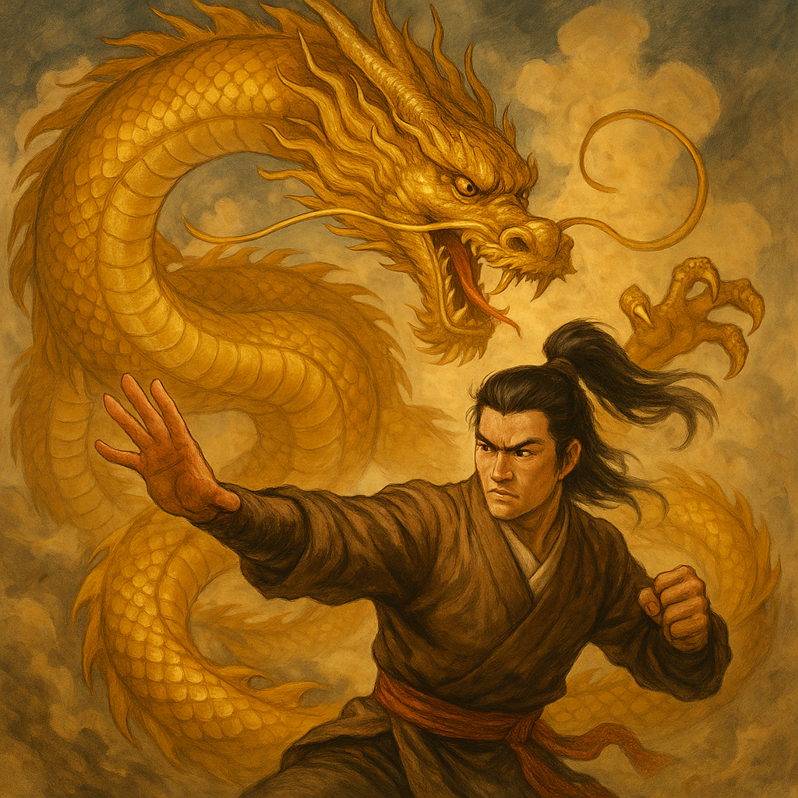
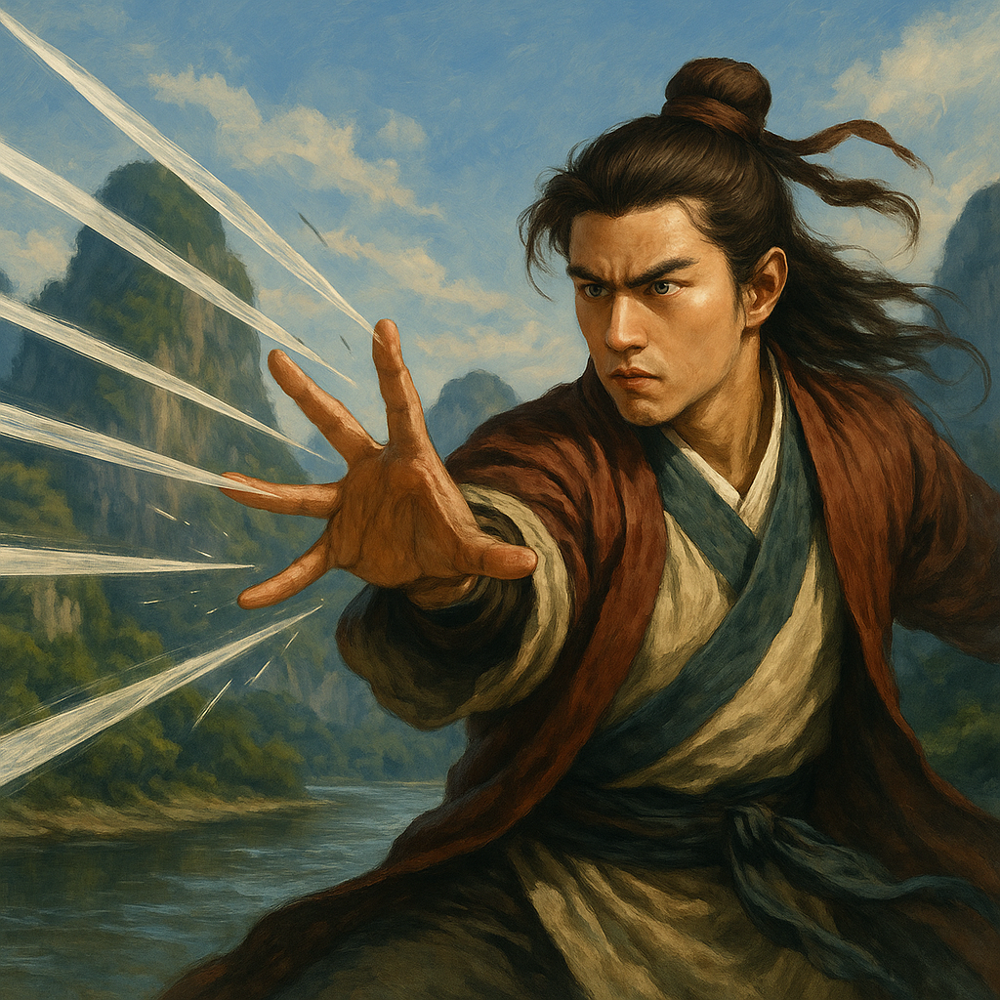
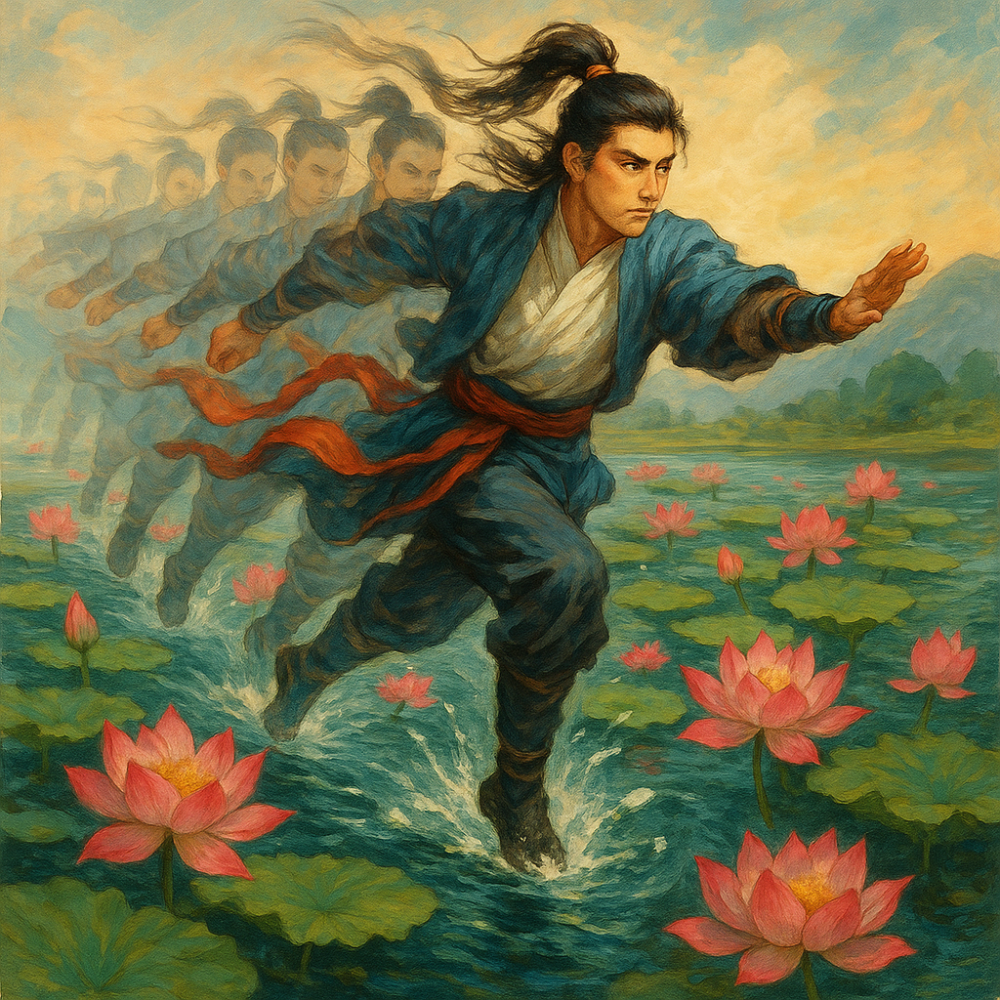

# 《天龙八部》中的绝世武功

同学们好！武侠小说中最让人着迷的部分之一，就是那些神乎其技的武功绝学了！在《天龙八部》这部武侠巨著中，金庸爷爷创造了许多令人叹为观止的武功。今天，让我们一起来了解这些奇妙的武功吧！

## 降龙十八掌

**使用者**：乔峰
**来源**：丐帮镇帮绝学
**等级**：天下一等一的掌法

降龙十八掌是丐帮的镇帮绝学，也是书中最为霸道刚猛的掌法之一。这套掌法相传源自古代高人，名字威武雄壮。

**特点**：
- 刚猛无比，力道惊人，是一门至刚至阳的武功
- 招式看似简单，却变化无穷，能以刚破巧，以强胜弱
- 掌风浩大，一掌劲力可震退数丈
- 越练威力越大，乔峰使用时威力更是倍增

**代表招式**：
- 亢龙有悔：一式高举向天，气势如虹
- 飞龙在天：一式破空而出，气势如龙腾飞
- 见龙在田：一式平推而出，刚猛异常

> 内在精神：降龙十八掌不仅是武功，更蕴含"侠之大者，为国为民"的气度与胸怀。

## 六脉神剑

**使用者**：段誉
**来源**：大理段氏祖传绝学
**等级**：天下一等一的指法

六脉神剑是大理段氏家传的绝学，指的是人体手臂的六条经脉：少商剑、少冲剑、商阳剑、中冲剑、关冲剑和少泽剑。这门武功可以将内力从指尖发出，形成无形剑气。

**特点**：
- 无形无相，肉眼难见，防不胜防
- 剑气可透物而出，隔空伤敌
- 需要深厚内力支持，否则伤害有限
- 六脉配合使用，威力大增

**修炼难度**：
六脉神剑极难修炼，段氏祖先将其修炼法门分开记录。段誉因误打误撞，短时间内练成，实属奇迹。

> 趣味知识：在武侠世界中，"指"和"剑"常常关联，如一阳指、六脉神剑等，都是用手指发挥剑般的威力。

## 北冥神功

**使用者**：段誉
**来源**：逍遥派内功心法
**等级**：上乘内功

北冥神功是逍遥派的镇派绝学之一，是一门可以吸取他人内力为己用的神奇内功。

**特点**：
- 能吸纳百川，纳百家武学于一身
- 越吸内力越强，潜力无穷
- 修炼者内力增长极快
- 内力柔和，可与刚猛武功相配合

**使用场景**：
段誉在无量山洞中偶然练成北冥神功，后在各种战斗中能轻易化解他人攻击，并将对方内力吸入体内。

> 伦理思考：北冥神功能吸他人内力，这样的武功是否符合侠义精神？这也是金庸爷爷留给我们的思考题。

## 凌波微步

**使用者**：段誉
**来源**：逍遥派轻功
**等级**：一等一轻功

凌波微步是逍遥派的绝学轻功，出自《易经》中的六十四卦，讲究的是变化多端、捉摸不定。

**特点**：
- 步法玄妙，如履平地，飘逸异常
- 遇强则避，遇弱则进，无招胜有招
- 可在危险环境中自保
- 步法看似散乱无章，实则暗合易理

**使用场景**：
段誉多次凭借凌波微步躲避强敌攻击，甚至能在万箭齐发中全身而退。

> 小知识：凌波微步的"微步"二字，暗示这种步法细微变化很大，看似普通，实则玄妙。

## 天山六阳掌 & 天山折梅手

**使用者**：虚竹（继承自天山童姥）
**来源**：逍遥派绝学
**等级**：一流武功

这两套武功是逍遥派的绝学，与小无相功配合使用，威力无穷。

**特点**：
- 天山六阳掌：至阳至刚，能化解生死符毒性
- 天山折梅手：招式精妙，能轻易化解各种武功招式
- 两者配合使用，攻守兼备

**使用场景**：
虚竹凭借这两套武功，能与武林高手过招不落下风，甚至能救人于危难之中。

## 斗转星移

**使用者**：慕容复
**来源**：慕容家族绝学
**等级**：一流武功

斗转星移是姑苏慕容家的绝学，以四两拨千斤的原理，将敌人的攻击力道反弹回去。

**特点**：
- 借力打力，以彼之道还施彼身
- 上乘内功支持下威力奇大
- 能模仿对手武功，识破其破绽
- "以彼之道，还施彼身"的典范

**使用场景**：
慕容复多次使用斗转星移化解敌人攻击，并反击致胜，令人叹为观止。

## 化功大法

**使用者**：丁春秋
**来源**：星宿派邪功
**等级**：邪派武功

化功大法是星宿派丁春秋的独门武功，能化去他人内力，壮大自身。

**特点**：
- 邪恶阴毒，专吸他人内力
- 修炼者实力增长极快
- 对手内力越强，吸收效果越好
- 有明显的副作用，容易走火入魔

**伦理思考**：
化功大法是一门典型的邪派武功，通过害人来增强自己。金庸爷爷通过这门武功，告诉我们走捷径往往会付出沉重代价。

## 小无相功

**使用者**：虚竹、鸠摩智
**来源**：逍遥派内功
**等级**：上乘内功

小无相功是逍遥派的高深内功，能够模仿各种武功招式，适应各种战斗需要。

**特点**：
- 无相无形，能随心所欲变化
- 适应性极强，能模仿各种武功
- 内力纯净，不偏不倚
- 是一门包容性极强的内功

**使用场景**：
虚竹继承小无相功后，能在短时间内掌握各种武功精髓，实力大增。

## 易筋经

**使用者**：少林高僧
**来源**：少林镇寺之宝
**等级**：上乘内功

易筋经是少林寺的镇寺之宝，相传由达摩祖师所创，是武林中最顶级的内功心法之一。

**特点**：
- 正大光明，刚柔并济
- 修炼后力大无穷，内力深厚
- 能增强筋骨，延年益寿
- 修炼难度极高，需要极强毅力

**使用场景**：
少林高僧修炼易筋经后，武功大进，在武林中享有极高声望。

---

通过这些精彩的武功介绍，我们可以看到金庸先生的想象力是多么丰富！这些武功不仅仅是打斗的技巧，更蕴含了中国传统文化中的哲学思想和价值观念。比如降龙十八掌代表着侠义精神，北冥神功和化功大法的对比则表现了正邪之分。

在《天龙八部》的世界里，武功高低往往不是最重要的，更重要的是使用武功的人心怀怎样的理想和抱负。乔峰、段誉和虚竹三位主角，尽管武功路数各不相同，但他们都用自己的能力帮助他人，行侠仗义，这才是金庸爷爷想要告诉我们的武侠精神！

